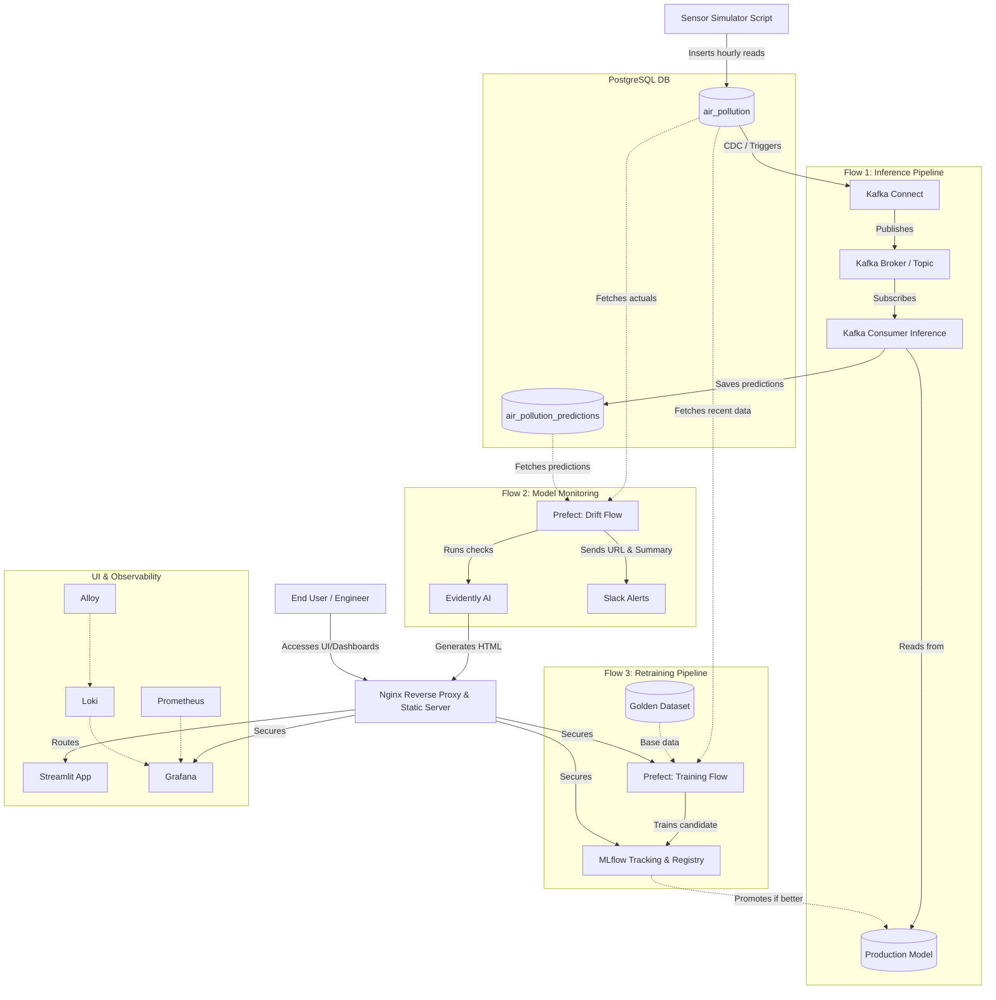

# AeroOps: Real-Time Air Quality Forecasting & Continuous Training Pipeline

## Overview
AeroOps is an end-to-end machine learning operations pipeline designed for real-time air quality forecasting. The system ingests simulated sensor data, performs real-time inference, monitors model degradation, and supports continuous retraining. All services are containerized and orchestrated via a modular Docker Compose architecture.

To secure internal services, Nginx is implemented as a reverse proxy, preventing direct external access to infrastructure components like MLflow, Prefect, and Prometheus.

## System Architecture



## Core Workflows

The system operates across three primary workflows:

### 1. Real-Time Inference Pipeline (Continuous)
*   **Data Ingestion:** A standalone Python script acts as a sensor simulator, writing hourly reading data into the `air_pollution` table in PostgreSQL.
*   **Event Streaming:** Kafka Connect monitors the PostgreSQL database for new inserts. When a new reading is detected, it acts as a producer, publishing the record to a Kafka topic.
*   **Inference:** A vanilla Python Kafka consumer subscribes to the topic, processes the incoming record, and runs it against the production model to forecast the next hour's air quality.
*   **Storage:** The predicted values are saved to the `air_pollution_predictions` table. When the next hour's actual data arrives, the cycle repeats.

### 2. Model Monitoring & Alerting (Scheduled)
*   **Orchestration:** Managed by a Prefect flow scheduled to run daily at 12:00 PM (when the final dataset for the previous day is complete).
*   **Drift Detection:** Evidently AI analyzes the actual readings against the predicted values to evaluate model performance and detect data drift.
*   **Reporting:** Evidently AI generates an HTML report detailing the model's health. Nginx serves these static HTML reports.
*   **Alerting:** A summary of the model's performance, along with the direct Nginx URL to the HTML report, is sent to a dedicated Slack channel for engineer review.

### 3. Continuous Training Pipeline (Manual/Triggered)
*   **Orchestration:** A Prefect flow triggered manually via the Prefect UI when model degradation is detected.
*   **Training & Evaluation:** The pipeline trains a candidate model using recent database records alongside a curated golden dataset.
*   **Experiment Tracking:** MLflow tracks all parameters, metrics, and artifacts. The candidate model is compared against the current production model.
*   **Promotion:** If the candidate model outperforms the existing model, it is automatically registered as the new production model in the MLflow Model Registry.

## Technology Stack
*   **Data Streaming:** Kafka, Kafka Connect
*   **Database:** PostgreSQL
*   **Orchestration & MLOps:** Prefect, MLflow, Evidently AI
*   **Monitoring & Observability:** Prometheus, Grafana, Loki, Alloy
*   **Web Server & Security:** Nginx
*   **Frontend UI:** Streamlit (Visualizing actual vs. predicted hourly/monthly data)
*   **Infrastructure:** Docker, Docker Compose

## Prerequisites
*   Docker and Docker Compose installed.
*   Python 3.9+ (if running tests or scripts locally).
*   `make` utility installed.

## Installation & Setup

**Important:** Because the Docker Compose files directly reference local images, you must build the Docker images before starting the environment.

1. **Build the Docker Images**
   ```bash
   make build_images
   ```
   *This command builds the required images for the Prefect flows, PostgreSQL database, inference scripts, Kafka Connect, and pulls the necessary external images.*

2. **Start the Infrastructure & Application**
   To start the entire system, including the initial model setup and the sensor simulator:
   ```bash
   make start_all
   ```
   *Behind the scenes, this starts the Docker Compose stack (including the `monitoring` profile), runs `init_model` to prepare the baseline model, and triggers `sensor_reads` to begin pushing hourly data.*

### Alternative Commands
*   `make start_core`: Starts only the core application stack without the heavy monitoring profile.
*   `make start_full`: Starts the complete Docker Compose stack (including monitoring) but does not run the Python initialization scripts.
*   `make teardown`: Spins down the standard containers and removes volumes.
*   `make teardown_profile`: Spins down the complete stack (including monitoring) and removes volumes.

## Testing & CI
The repository includes a continuous integration pipeline configured for automated testing. Tests are separated into unit and integration suites.

To run tests locally:
*   **Unit Tests:** `make test_unit`
*   **Integration Tests:** `make test_integration`
